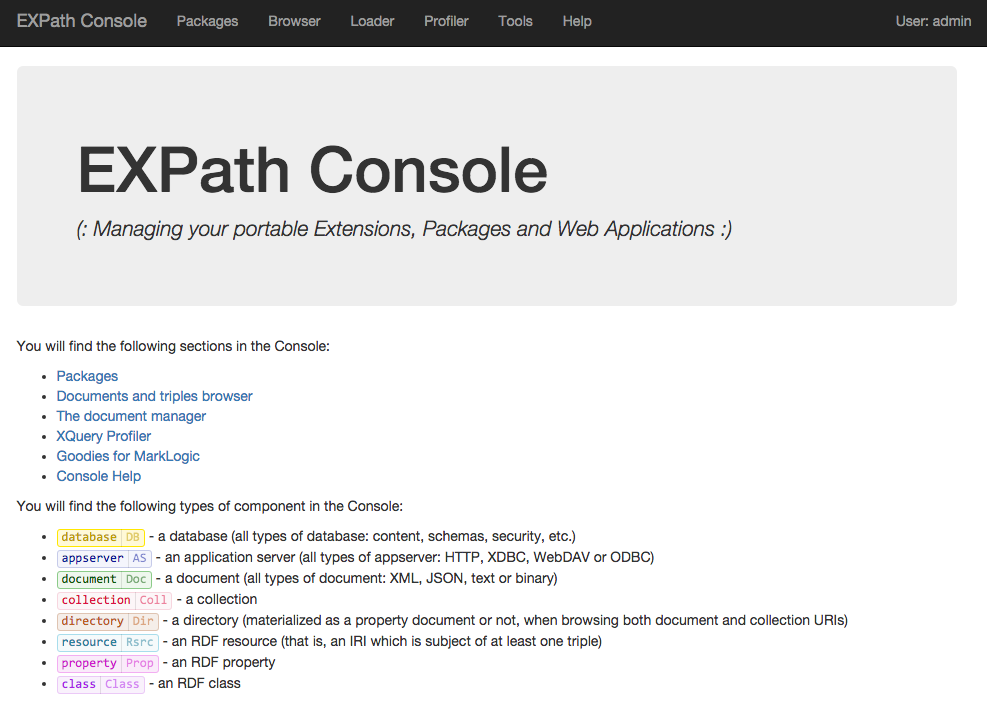

# EXPath Console for MarkLogic

Download the latest version from the EXPath [download area](http://expath.org/files).



## Installation

You need to:

- Get the code.
- Create a new HTTP app server.
- Set its modules location.
- Set its URL rewriter.

You can get the code from to different sources (in both cases the root
of the sources is the directory `src/`):

- Get the latest stable version from the EXPath
  [download area](http://expath.org/files) (search for the ZIP file
  with the name "*EXPath Console for MarkLogic*").
- Clone the
  [GitHub repository](https://github.com/fgeorges/expath-ml-console)
  (the branch `master` should correspond to the latest stable release,
  when `develop` is the main development branch).

Then you can create the HTTP app server and make it point to the
source directory (or upload the sources to a modules database if you
really need to):

- Create a new HTTP server in the MarkLogic admin console.
- Put the source code of the Console at the root of the App Server
  (depending on the options you selected creating the App Server, it
  could be on its modules database or on the filesystem if you decided
  to store the modules of this App Server on the filesystem).
- Make sure to set the app server URL rewriter field (at the end of
  the admin console page for the app server) to the value
  `/plumbing/rewriter.xml`.

The document database linked to the HTTP server will not be used by
the EXPath Console for MarkLogic.  So use whetever database you want
for that field (e.g. use the default `Documents` database).

That's it!  You can now access the Console by pointing your preferred
browser to the appropriate App Server (you might need to adapt the
port number, depending on how you configured your app server):
[http://localhost:8010/](http://localhost:8010/).

## Introduction

The EXPath Console for MarkLogic comes with several tools.  The main
goal though is to provide a repository manager and support for
[XAR packages](http://expath.org/spec/pkg).  A XAR package is a
collection of XML-related files, like XQuery modules, XSLT stylesheets
or XML schemas.  The console helps installing packages on specific app
servers.

Once a package has been installed on an app server, other modules
running in the same app server can import an XQuery modules from the
package, just by importing it using the module namespace.  Without
specifying any "at clause", decoupling dependencies between the
importing and the imported modules:

```xquery
import module namespace "http://example.org/cool/lib.xql";
```

[CXAN](http://cxan.org/) is an organized, online source of packages,
if you are looking for a specific library or application.  The page to
install a package into an app server supports installed straight from
CXAN.

## Pages

Every page should be self-explaining.  If one page does not contain
enough help for you to understand what to do, please report it to the
EXPath [mailing list](http://expath.org/lists).  The top-level pages,
or area, are the following:

- The page "Packages" lists all the app servers.  From a specific app
  server page, you can enable package support (by default it is
  disabled, in order to enable it, the Console has tp create an
  internal repository on its modules database or on the filesystem).
  Once package support has been enabled, a specific app server page
  offers the ability to install packages for this app server (from
  your filesystem or directly from CXAN).
- The page "Tools" provides some general-purpose tools for MarkLogic,
  as well as the source of the internal Console config files.
